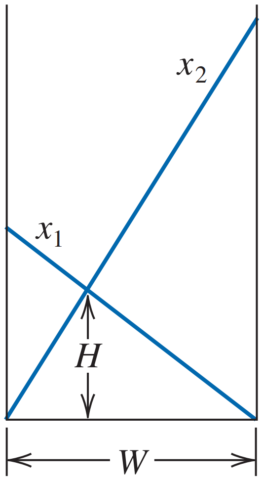
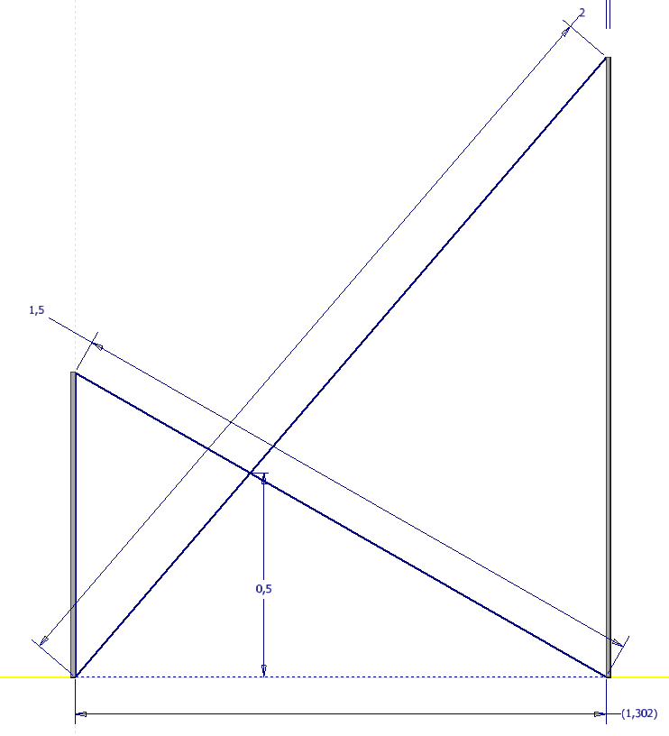

# Descripción

Dos escaleras de longitud $x_1$ y $x_2$ están inclinadas desde las paredes opuestas de un pasillo de ancho $W$, como se muestra en la siguiente figura. 

Asumiendo que se conoce $x_1$, $x_2$ y la altura $H$ donde las escaleras se cruzan, determine el ancho del pasillo $W$. 

## Ejemplo
    
Dado $x1 = 1.5 [m]$, $x2 = 2 [m]$, $H = 0.5 [m]$ como se muestra en la figura, el ancho del pasillo sería de $W = 1.302 [m]$.

# Objetivo
Implementar un programa interactivo que reciba como entrada los valores de $x1$, $x2$ y $H$ y devuelva el valor de $W$.

Graficar la solución.
