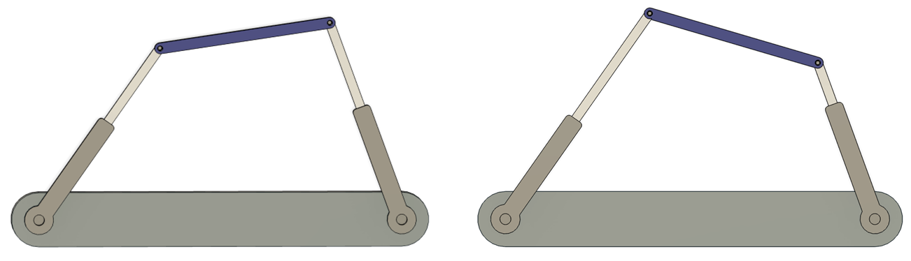
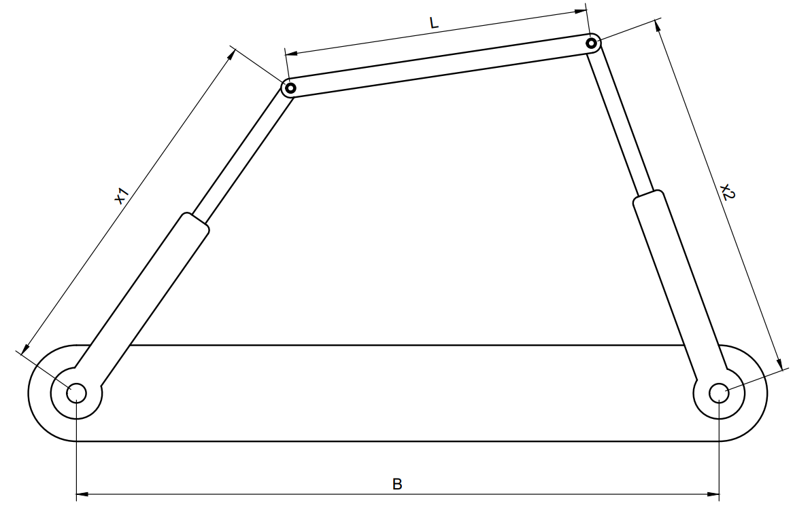

# Descripción

El telescopio James Webb usa un mecanismo basado en pistones lineales que permiten ajustar la orientación de un espejo principal.

Para este proyecto asumiremos una geometría simplificada de este mecanismo. Considere un telescopio con un espejo principal de forma rectangular de largo $L$. El espejo se orienta a través de dos pistones que se encuentran en los extremos del espejo y ajustados a una base fija de separación $B$. Cada pistón puede extenderse o contraerse de manera independiente. La extensión de cada pistón $x_i$ está entre los límites $d_{min}\leq x \leq  d_{max}$.

# Objetivo
Determine la distancia de cada uno de los pistones para enfocar el telescopio a un punto $P(x,y)$ desde el centro de la base.
Recuerde que el espejo principal debe ser perpendicular a la dirección del punto $P$.

Realice una interfraz gráfica que muestre la orientación del espejo principal y permita ingresar los parámetros de entrada.
## Párametros de entrada
* $L$: Largo del espejo.
* $B$: Separación entre los pistones.
* $d_{min}$: Longitud mínima de los pistones.
* $d_{max}$: Longitud máxima de los pistones.
* $P(x,y)$: Coordenadas del punto en el espacio.

## Párametros de salida
* $x_1$: Longitud del pistón 1.
* $x_2$: Longitud del pistón 2.