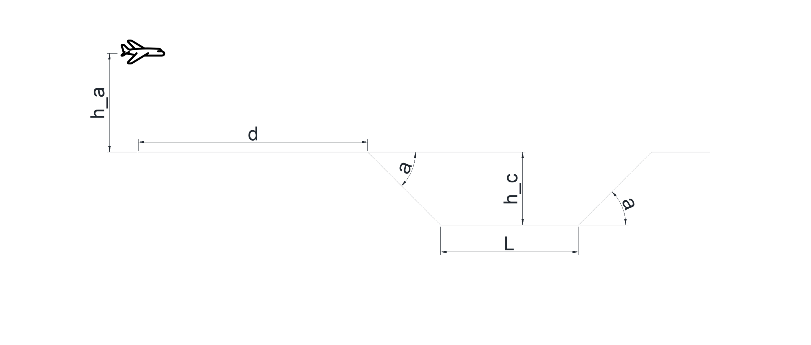

# Descripción

Un avión vuela con velocidad $V$ a $H_a$ metros del suelo en dirección a un cañón como se muestra en la figura. 

El cañón tiene forma de trapecio isósceles invertido, de una altura $H_c$, largo $L$ y ángulo $\alpha$ con respecto al horizonte.

Cuando se encuentra a una distancia $d$ del borde del cañón, el avión suelta una bomba. 

# Objetivo
* Grafique la trayectoria de la bomba y el punto de impacto. 
